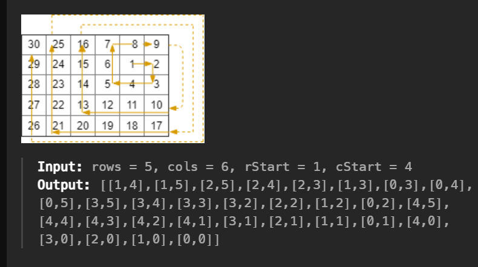

**Question**
Write a function to generate an \( n \times n \) matrix filled with numbers from \( 1 \) to \( n^2 \) in a spiral order, starting from the top-left corner and proceeding in the following order: right, down, left, and up, until the entire matrix is filled.
*[Spiral matrix II](APSS problems/spiral_matrix_2.py)*
### Example:
For \( n = 5 \), the output matrix should be:
```
[1, 2, 3, 4, 5]
[16, 17, 18, 19, 6]
[15, 24, 25, 20, 7]
[14, 23, 22, 21, 8]
[13, 12, 11, 10, 9]
```

---

**Intuition**
The key to solving this problem is simulating the process of filling the matrix in a spiral order. Start by initializing an empty \( n \times n \) matrix and define boundaries for the top, bottom, left, and right edges of the matrix. Use a loop to fill numbers from \( 1 \) to \( n^2 \), updating the matrix while respecting the current direction of traversal (right, down, left, or up). Adjust the boundaries after completing each layer of the spiral.

### Key Steps:
1. **Initialize the Matrix**: Create an \( n \times n \) matrix filled with zeros.
2. **Define Boundaries**: Use variables `top`, `bottom`, `left`, and `right` to keep track of the current layer of the spiral.
3. **Simulate Spiral Filling**:
   - Traverse the top row (left to right), then increment `top`.
   - Traverse the right column (top to bottom), then decrement `right`.
   - Traverse the bottom row (right to left), then decrement `bottom`.
   - Traverse the left column (bottom to top), then increment `left`.
4. **Stop Condition**: Continue filling until all numbers from \( 1 \) to \( n^2 \) are placed.

---

**Code**
```python
def spiral_matrix(n: int):
    # Step 1: Initialize the matrix
    frame = [[0 for _ in range(n)] for _ in range(n)]

    # Step 2: Initialize boundaries and starting index
    top, bottom, left, right = 0, n - 1, 0, n - 1
    index = 1

    # Step 3: Simulate the spiral filling
    while index <= n**2:
        # Traverse top row from left to right
        for j in range(left, right + 1):
            frame[top][j] = index
            index += 1
        top += 1

        # Traverse right column from top to bottom
        for i in range(top, bottom + 1):
            frame[i][right] = index
            index += 1
        right -= 1

        # Traverse bottom row from right to left
        for j in range(right, left - 1, -1):
            frame[bottom][j] = index
            index += 1
        bottom -= 1

        # Traverse left column from bottom to top
        for i in range(bottom, top - 1, -1):
            frame[i][left] = index
            index += 1
        left += 1

    return frame

if __name__ == "__main__":
    n = 5
    result = spiral_matrix(n)
    for row in result:
        print(row)
```

---

**Explanation of Code**
1. **Matrix Initialization**: The matrix is initialized with zeros using a list comprehension.
2. **Boundary Updates**: Each boundary (`top`, `bottom`, `left`, `right`) is adjusted after filling the corresponding row or column.
3. **Direction Control**: The traversal order is strictly maintained (right, down, left, up).
4. **Stop Condition**: The loop terminates once all numbers from \( 1 \) to \( n^2 \) are filled.

---

**Output**
For \( n = 5 \):
```
[1, 2, 3, 4, 5]
[16, 17, 18, 19, 6]
[15, 24, 25, 20, 7]
[14, 23, 22, 21, 8]
[13, 12, 11, 10, 9]
```

=================================

---
re attempt this
https://leetcode.com/problems/spiral-matrix/

=================================

[Spiral Matrix III](https://leetcode.com/problems/spiral-matrix-iii)

Return an array of coordinates representing the positions of the grid in the order you visited them.



The goal is to traverse a grid in a spiral pattern starting from a given point \((rStart, cStart)\). We expand the spiral by alternating between horizontal (left-to-right, right-to-left) and vertical (top-to-bottom, bottom-to-top) movements. Each spiral "layer" increases in size by one step after completing two directions. 

At each step:
1. Move in the current direction by updating row or column.
2. Check if the new position is within the grid bounds. If valid, add it to the result list.
3. Increment the step size after completing both horizontal and vertical moves.

Repeat the process until all cells in the grid are visited, ensuring that no cell is skipped.

```python
class Solution:
    def spiralMatrixIII(self, rows: int, cols: int, rStart: int, cStart: int) -> List[List[int]]:
        res = []
        step = 1
        index = 1
        totalcells = rows * cols
        res.append([rStart, cStart])

        while index < totalcells:
            # Motion left to right
            for _ in range(step):
                cStart += 1
                if 0 <= cStart < cols and 0 <= rStart < rows:
                    res.append([rStart, cStart])
                    index += 1
            # Motion top to bottom
            for _ in range(step):
                rStart += 1
                if 0 <= cStart < cols and 0 <= rStart < rows:
                    res.append([rStart, cStart])
                    index += 1
            # Increase step size after completing right and down
            step += 1

            # Motion right to left
            for _ in range(step):
                cStart -= 1
                if 0 <= cStart < cols and 0 <= rStart < rows:
                    res.append([rStart, cStart])
                    index += 1
            # Motion bottom to top
            for _ in range(step):
                rStart -= 1
                if 0 <= cStart < cols and 0 <= rStart < rows:
                    res.append([rStart, cStart])
                    index += 1
            # Increase step size after completing left and up
            step += 1

        return res
```

### Another approach

The goal of this function is to return all the cells of a given `rows x cols` matrix in a **spiral** order starting from `(rStart, cStart)`. The movement follows **right → down → left → up**, repeating in an expanding square pattern.

```python
class Solution:
    def spiralMatrixIII(self, rows: int, cols: int, rStart: int, cStart: int) -> List[List[int]]:
        directions = [(0, 1), (1, 0), (0, -1), (-1, 0)]  # East, South, West, North
        result = [[rStart, cStart]]
        total_cells = rows * cols
        steps = 0
        direction_index = 0
        
        while len(result) < total_cells:
            if direction_index % 2 == 0:
                steps += 1
            
            for _ in range(steps):
                rStart += directions[direction_index][0]
                cStart += directions[direction_index][1]
                
                if 0 <= rStart < rows and 0 <= cStart < cols:
                    result.append([rStart, cStart])
                    if len(result) == total_cells:
                        return result
            
            direction_index = (direction_index + 1) % 4
        
        return result
```

### **Step-by-Step Explanation**
#### **Initialization**
- `directions = [(0, 1), (1, 0), (0, -1), (-1, 0)]`  
  - Defines movement directions: Right → Down → Left → Up.
- `result = [[rStart, cStart]]`  
  - Stores visited positions; starts with the initial position.
- `total_cells = rows * cols`  
  - Total number of cells to visit.
- `steps = 0`  
  - Tracks how many steps we move in a given direction.
- `direction_index = 0`  
  - Keeps track of the current movement direction (indexing `directions` list).

---

### **How the Spiral Expansion Works**
1. **Every two turns, increase the step size (`steps += 1`)**  
   - Because the pattern follows **Right → Down → Left → Up**, every odd direction change (`Right` and `Left`) requires extending the movement range.

2. **Move in the current direction for the given number of `steps`**  
   - If the position is **inside** the matrix (`0 ≤ r < rows` and `0 ≤ c < cols`), add it to `result`.

3. **Rotate to the next direction (`direction_index = (direction_index + 1) % 4`)**  
   - Ensures the movement follows the pattern **Right → Down → Left → Up** cyclically.

---

### **Example Walkthrough**
#### **Input**
```python
rows = 5, cols = 6, rStart = 1, cStart = 4
```
#### **Execution**
| Step | Direction | Steps | New Position | Added to Result? | Current `result` |
|------|------------|--------|---------------|------------------|------------------|
| **0**  | Start     | -      | `(1,4)`       | ✅               | `[[1,4]]`        |
| **1**  | → Right  | `1`    | `(1,5)`       | ✅               | `[[1,4], [1,5]]` |
| **2**  | ↓ Down   | `1`    | `(2,5)`       | ✅               | `[[1,4], [1,5], [2,5]]` |
| **3**  | ← Left   | `2`    | `(2,4)`       | ✅               | `[[1,4], [1,5], [2,5], [2,4]]` |
|        |          |        | `(2,3)`       | ✅               | `[[1,4], [1,5], [2,5], [2,4], [2,3]]` |
| **4**  | ↑ Up     | `2`    | `(1,3)`       | ✅               | `[[1,4], [1,5], [2,5], [2,4], [2,3], [1,3]]` |
|        |          |        | `(0,3)`       | ✅               | `[[1,4], [1,5], [2,5], [2,4], [2,3], [1,3], [0,3]]` |
| **5**  | → Right  | `3`    | `(0,4)`       | ✅               | `[[1,4], [1,5], [2,5], [2,4], [2,3], [1,3], [0,3], [0,4]]` |
|        |          |        | `(0,5)`       | ✅               | `[[1,4], [1,5], [2,5], [2,4], [2,3], [1,3], [0,3], [0,4], [0,5]]` |
|        |          |        | `(0,6)`       | ❌ (out of bounds) | Skipped |
| **6**  | ↓ Down   | `3`    | `(1,6)`       | ❌ (out of bounds) | Skipped |
|        |          |        | `(2,6)`       | ❌ (out of bounds) | Skipped |
|        |          |        | `(3,6)`       | ❌ (out of bounds) | Skipped |
| **7**  | ← Left   | `4`    | `(3,5)`       | ✅               | `[[...], [3,5]]` |
|        |          |        | `(3,4)`       | ✅               | `[[...], [3,4]]` |
|        |          |        | `(3,3)`       | ✅               | `[[...], [3,3]]` |
|        |          |        | `(3,2)`       | ✅               | `[[...], [3,2]]` |
| **8**  | ↑ Up     | `4`    | `(2,2)`       | ✅               | `[[...], [2,2]]` |
|        |          |        | `(1,2)`       | ✅               | `[[...], [1,2]]` |
|        |          |        | `(0,2)`       | ✅               | `[[...], [0,2]]` |
|        |          |        | `(-1,2)`      | ❌ (out of bounds) | Skipped |

The process continues until all cells are visited.

---

### **Complexity Analysis**
- **Time Complexity**: O(rows x cols), since every valid cell is visited exactly once.
- **Space Complexity**: O(rows x cols), as the result stores all matrix positions.

---

### **Key Takeaways**
1. **Direction-based traversal**: Movement follows a predefined cyclic pattern.
2. **Step increments every two turns**: Ensures the spiral expands outward.
3. **Out-of-bounds checks**: Ensures only valid matrix positions are added to `result`.

This approach ensures an efficient traversal while maintaining the expected spiral order. 🚀

===========================

[Spiral Matrix](https://leetcode.com/problems/spiral-matrix)

### **Optimized Solution**
We can simplify and optimize the solution as follows:

```python
from typing import List

class Solution:
    def spiralOrder(self, matrix: List[List[int]]) -> List[int]:
        # Define boundaries
        top, bottom, left, right = 0, len(matrix) - 1, 0, len(matrix[0]) - 1
        res = []  # Resultant list to store elements in spiral order
        
        # Continue while there are elements left to process
        while top <= bottom and left <= right:
            # Traverse from left to right along the top row
            for j in range(left, right + 1):
                res.append(matrix[top][j])
            top += 1  # Move the top boundary down
            
            # Traverse from top to bottom along the right column
            for i in range(top, bottom + 1):
                res.append(matrix[i][right])
            right -= 1  # Move the right boundary left
            
            # Traverse from right to left along the bottom row (if not already processed)
            if top <= bottom:
                for j in range(right, left - 1, -1):
                    res.append(matrix[bottom][j])
                bottom -= 1  # Move the bottom boundary up
            
            # Traverse from bottom to top along the left column (if not already processed)
            if left <= right:
                for i in range(bottom, top - 1, -1):
                    res.append(matrix[i][left])
                left += 1  # Move the left boundary right
        
        return res
```

**Another Method**

```python
from typing import List

class Solution:
    def spiralOrder(self, A: List[List[int]]) -> List[int]:
        T, B, L, R = 0, len(A) - 1, 0, len(A[0]) - 1
        dir = 0
        ans = []

        while T <= B and L <= R:
            if dir == 0:  # Traverse from left to right
                for i in range(L, R + 1):
                    ans.append(A[T][i])
                T += 1
            elif dir == 1:  # Traverse from top to bottom
                for i in range(T, B + 1):
                    ans.append(A[i][R])
                R -= 1
            elif dir == 2:  # Traverse from right to left
                for i in range(R, L - 1, -1):
                    ans.append(A[B][i])
                B -= 1
            elif dir == 3:  # Traverse from bottom to top
                for i in range(B, T - 1, -1):
                    ans.append(A[i][L])
                L += 1
            dir = (dir + 1) % 4  # Update direction

        return ans
```

### **Explanation of the Optimized Code**
1. **Boundary Conditions**:
   - `top`, `bottom`, `left`, and `right` define the boundaries of the unprocessed portion of the matrix.
   - After processing a row or column, the respective boundary is updated to shrink the unprocessed area.

2. **Conditions for Traversal**:
   - The checks `if top <= bottom` and `if left <= right` ensure that rows or columns are processed only if they haven't been visited already.

3. **Termination**:
   - The loop runs as long as there are rows or columns left to process (`top <= bottom` and `left <= right`).

### **Time Complexity**
- **O(m * n)**: Each element of the matrix is visited exactly once.
  
### **Space Complexity**
- **O(1)**: Aside from the result list, no extra space is used.

---

### **Input/Output Examples**

#### Example 1:
```python
matrix = [[1, 2, 3, 4], [5, 6, 7, 8], [9, 10, 11, 12]]
sol = Solution()
print(sol.spiralOrder(matrix))
# Output: [1, 2, 3, 4, 8, 12, 11, 10, 9, 5, 6, 7]
```

#### Example 2:
```python
matrix = [[1]]
sol = Solution()
print(sol.spiralOrder(matrix))
# Output: [1]
```
---

### Solution using another Approach

### Python Code
```python
def spiralOrder(self, matrix):
    return matrix and list(matrix.pop(0)) + self.spiralOrder(zip(*matrix)[::-1])
```

### Explanation

#### Key Components of the Code
1. **Base Case**:
   - `matrix`: This ensures the recursion stops when the matrix is empty (i.e., all rows are processed).

2. **Breaking the Problem into Smaller Parts**:
   - `matrix.pop(0)`: Removes and retrieves the first row of the matrix (top row in spiral traversal).
   - `list(matrix.pop(0))`: Converts the retrieved row into a list (if needed).

3. **Recursive Call**:
   - `zip(*matrix)`: Transposes the remaining part of the matrix.
   - `[::-1]`: Reverses the rows of the transposed matrix to simulate a 90-degree counterclockwise rotation.
   - `self.spiralOrder(...)`: Recursively calls the function on the rotated matrix.

4. **Combining Results**:
   - `list(matrix.pop(0)) + ...`: Appends the current top row to the result of the recursive call, building the spiral order output incrementally.

#### Breakdown of Key Operations

##### **1. `zip` Function**
- Combines multiple iterables element-wise into a single iterable of tuples.

###### Example:
```python
a = [1, 2, 3]
b = [4, 5, 6]
result = zip(a, b)
print(list(result))  # Output: [(1, 4), (2, 5), (3, 6)]
```
- In the matrix context, `zip(*matrix)` transposes the matrix:

###### Example:
```python
matrix = [[1, 2, 3], [4, 5, 6], [7, 8, 9]]
result = zip(*matrix)
print(list(result))  # Output: [(1, 4, 7), (2, 5, 8), (3, 6, 9)]
```

##### **2. `*matrix` (Unpacking Operator)**
- Expands the matrix into separate rows as arguments for the `zip` function.

##### **3. `[::-1]` (Reverse Slicing)**
- Reverses the sequence, simulating a 90-degree counterclockwise rotation.

###### Example:
```python
lst = [1, 2, 3, 4, 5]
print(lst[::-1])  # Output: [5, 4, 3, 2, 1]
```
- Applied to the transposed matrix:
  - Original Transposed: `[(1, 4, 7), (2, 5, 8), (3, 6, 9)]`
  - After `[::-1]`: `[(3, 6, 9), (2, 5, 8), (1, 4, 7)]`

---

### Complexity Analysis

### Time Complexity
- Each row or column is processed once, making the time complexity **O(m * n)**, where `m` is the number of rows and `n` is the number of columns.

### Space Complexity
- **Recursive Stack**: Depends on the depth of recursion. In the worst case (square matrix), the depth is **O(min(m, n))**.
- **Additional Space**: Transposition and reversal involve temporary memory proportional to the matrix size.
- Overall space complexity is **O(m * n)**.

---

### Example Walkthrough

#### Input:
```python
matrix = [
    [1, 2, 3],
    [4, 5, 6],
    [7, 8, 9]
]
```

#### Steps:
1. **First Iteration**:
   - `matrix.pop(0)`: `[1, 2, 3]` (top row)
   - Remaining `matrix`: `[[4, 5, 6], [7, 8, 9]]`
   - `zip(*matrix)`: `[(4, 7), (5, 8), (6, 9)]`
   - `[::-1]`: `[(6, 9), (5, 8), (4, 7)]`

2. **Recursive Calls**:
   - Process the rotated matrix, adding rows to the result in spiral order.

#### Output:
```python
[1, 2, 3, 6, 9, 8, 7, 4, 5]
```
---

===========================
[Spiral Matrix IV](C:\Users\gchamb02\Desktop\Gaurav Learnings\python\DSA_python\APSS problems\spiral_matrix_4.py)

You are given two integers m and n, which represent the dimensions of a matrix.
You are also given the head of a linked list of integers.
Generate an m x n matrix that contains the integers in the linked list presented in spiral order (clockwise), starting from the top-left of the matrix. If there are remaining empty spaces, fill them with -1.
Return the generated matrix.

```python
class ListNode:
    def __init__(self, val=0, next=None):
        self.val = val
        self.next = next


from typing import Optional, List

class Solution:
    def spiralMatrix(self, m: int, n: int, head: Optional[ListNode]) -> List[List[int]]:
        # declare vairables
        left, right, top, bottom = 0, n, 0, m
        # intialize a matrix with mxn
        res = [[-1 for _ in range(n)] for _ in range(m)]
        # return res
        # looping
        while head:
            for col in range(left, right):
                if not head:
                    return res
                res[top][col] = head.val
                head = head.next
            top +=1
            for row in range(top, bottom):
                if not head:
                    return res
                res[row][right-1] = head.val
                head = head.next
            right -=1
            if left <= right:
                for col in range(right-1, left-1, -1):
                    if not head:
                        return res
                    res[bottom-1][col] = head.val
                    head = head.next
                bottom -=1
            if top <= bottom:
                for row in range(bottom -1, top-1,-1):
                    if not head:
                        return res
                    res[row][left] = head.val
                    head = head.next
                left +=1

        return res
```


===========================
[Efficient Range Sum Queries Using Prefix Sums](C:\Users\gchamb02\Desktop\Gaurav Learnings\python\DSA_python\APSS problems\Accumulator Variables.py)

#### **Optimized Solution**
We can simplify and optimize the solution as follows:

```python
def compute_prefix_sum(arr):
    """Compute the prefix sums array."""
    prefix_sum = [0] * len(arr)
    prefix_sum[0] = arr[0]
    for i in range(1, len(arr)):
        prefix_sum[i] = prefix_sum[i - 1] + arr[i]
    return prefix_sum

def range_sum_query(i, j, prefix_sum):
    """Compute the sum of elements from index i to j using the prefix sums array."""
    if i < 0 or j >= len(prefix_sum) or i > j:
        print("Invalid indices!")
        return 0
    if i == 0:
        return prefix_sum[j]
    return prefix_sum[j] - prefix_sum[i - 1]

# Test data
testset10 = [
    [1, 2, []],
    [2, 4, [0, 0, 0, 0]],
    [4, 5, [1, 81, 0, 8, 47, 100, 4, 7]],
    [1, 2, [1, 54, 4]]
]

for val in testset10:
    i, j, arr = val
    if not arr:
        print("Empty input array!")
        continue
    prefix_sum = compute_prefix_sum(arr)
    result = range_sum_query(i, j, prefix_sum)
    print(f"Sum from index {i} to {j}: {result}")
```

### **Explanation of the Optimized Code**
1. **Function `compute_prefix_sum`**:
   - This function computes the prefix sums array for the given input array. The prefix sum at index `i` is the sum of all elements from the start of the array up to index `i`.
   - It initializes the first element of the prefix sums array with the first element of the input array and then iterates through the array to compute the cumulative sums.

2. **Function `range_sum_query`**:
   - This function uses the prefix sums array to compute the sum of elements between indices `i` and `j` in constant time.
   - It handles edge cases such as invalid indices and when `i` is 0.

### **Time Complexity**
- **O(n)**: The `compute_prefix_sum` function runs in linear time, where `n` is the length of the input array. The `range_sum_query` function runs in constant time \(O(1)\).

### **Space Complexity**
- **O(n)**: The prefix sums array requires additional space proportional to the length of the input array.

---

### **Input/Output Examples**

#### Example 1:
```python
input = [1, 2, 3, 4, 5]
prefix_sum = compute_prefix_sum(input)
print(range_sum_query(1, 3, prefix_sum))
# Output: 9 (2 + 3 + 4)
```

#### Example 2:
```python
input = [10, 20, 30, 40, 50]
prefix_sum = compute_prefix_sum(input)
print(range_sum_query(0, 4, prefix_sum))
# Output: 150 (10 + 20 + 30 + 40 + 50)
```


===========================

### [Reverse a String Using Recursion](C:\Users\gchamb02\Desktop\Gaurav Learnings\python\DSA_python\APSS problems\Accumulator Variables.py)

### Problem Statement
Reverse a given string by recursively swapping characters from the ends towards the center.

---

### Approach 1: Reverse Without Slicing

### Explanation
This approach uses two indices (`start` and `end`) to swap characters in the string until the indices meet or cross. A list is used to perform swaps since strings in Python are immutable. The reversed string is then constructed from the list.

### Code
```python
def reverse_string_recursive_no_slicing(inputstr, start, end, result=None):
    if result is None:
        result = list(inputstr)  # Convert string to list for mutability

    # Base case: When start index meets or crosses end index
    if start >= end:
        return ''.join(result)

    # Swap characters at start and end
    result[start], result[end] = result[end], result[start]

    # Recursive step: Move towards the middle
    return reverse_string_recursive_no_slicing(inputstr, start + 1, end - 1, result)
```

### Test Cases
```python
# Test cases
testcase4 = [
    ['', ''],                  # Empty string
    ['abc', 'cba'],            # Odd-length string
    ['abcdef', 'fedcba'],      # Even-length string
    ['a!b@c#d$', '$d#c@b!a'], # String with special characters
    ['madam', 'madam'],        # Palindrome
    ['123456789', '987654321'],# Numbers
    [' space ', ' ecaps ']     # String with spaces
]

for val in testcase4:
    input_str, expected = val
    result = reverse_string_recursive_no_slicing(input_str, 0, len(input_str) - 1)
    print(f"Input: {input_str} | Reversed: {result} | Expected: {expected} | {'PASS' if result == expected else 'FAIL'}")
```

---

### Approach 2: Reverse Using Slicing

### Explanation
This approach reverses the string by recursively moving the last character to the front and reversing the rest of the string. Slicing is used to remove the last character at each recursive step.

### Code
```python
def reverse_string_recursive(inputstr):
    # Base case: If the string is empty or has only one character
    if len(inputstr) <= 1:
        return inputstr

    # Recursive case: Reverse the rest of the string and add the current first character to the end
    return inputstr[-1] + reverse_string_recursive(inputstr[:-1])
```

### Test Cases
```python
# Test cases
testcase4 = [
    ['', ''],                  # Empty string
    ['abc', 'cba'],            # Odd-length string
    ['abcdef', 'fedcba'],      # Even-length string
    ['a!b@c#d$', '$d#c@b!a'], # String with special characters
    ['madam', 'madam'],        # Palindrome
    ['123456789', '987654321'],# Numbers
    [' space ', ' ecaps ']     # String with spaces
]

for val in testcase4:
    input_str, expected = val
    result = reverse_string_recursive(input_str)
    print(f"Input: {input_str} | Reversed: {result} | Expected: {expected} | {'PASS' if result == expected else 'FAIL'}")
```

---

### Comparison of Approaches
| **Aspect**                 | **Without Slicing**                        | **With Slicing**                |
|----------------------------|--------------------------------------------|---------------------------------|
| **Time Complexity**        | \(O(n)\)                                  | \(O(n^2)\) (due to slicing)     |
| **Space Complexity**       | \(O(n)\) (for result list)                | \(O(n)\) (call stack and slices)|
| **Efficiency**             | Faster for large strings                  | Slower for large strings        |
| **Mutability**             | Handles immutability via list conversion  | No need for list conversion     |

---

*[Efficient Range Sum Queries Using Prefix Sums](C:\Users\gchamb02\Desktop\Gaurav Learnings\python\DSA_python\APSS problems\Accumulator Variables.py)*

**Question**  
Write functions to compute the prefix sum of an array and efficiently answer multiple range sum queries.  
Use the prefix sum array to calculate the sum of elements between indices ( i ) and ( j ) in constant time.  

---

**Intuition**  
The prefix sum is a cumulative sum of the elements in an array. It simplifies answering range sum queries by storing precomputed sums up to each index. Instead of summing elements repeatedly for each query, use the difference between precomputed prefix sums. This technique significantly reduces the time complexity of range queries from ( O(n) ) to ( O(1) ).  

### Key Steps:
1. **Compute Prefix Sum**:
   - Initialize a `prefix_sum` array.
   - Set the first element of `prefix_sum` to the first element of the input array.
   - For each subsequent element, compute the cumulative sum as ( text{prefix_sum}[i] = text{prefix_sum}[i - 1] + text{arr}[i] ).

2. **Answer Range Queries**:
   - Use ( text{prefix_sum}[j] - text{prefix_sum}[i - 1] ) to calculate the sum of elements from index ( i ) to ( j ).
   - Handle edge cases when ( i = 0 ), where the sum is ( text{prefix_sum}[j] ).

---

**Code**  
```python
def compute_prefix_sum(arr):
    """Compute the prefix sums array."""
    prefix_sum = [0] * len(arr)
    prefix_sum[0] = arr[0]
    for i in range(1, len(arr)):
        prefix_sum[i] = prefix_sum[i - 1] + arr[i]
    return prefix_sum

def range_sum_query(i, j, prefix_sum):
    """Compute the sum of elements from index i to j using the prefix sums array."""
    if i < 0 or j >= len(prefix_sum) or i > j:
        print("Invalid indices!")
        return 0
    if i == 0:
        return prefix_sum[j]
    return prefix_sum[j] - prefix_sum[i - 1]
```

---

**Explanation of Code**
1. **Prefix Sum Computation**:
   - A `prefix_sum` array is initialized, and each element is computed as the cumulative sum up to that index.

2. **Range Query Calculation**:
   - For valid indices ( i ) and ( j ), the sum is derived using the difference in prefix sums.
   - If ( i = 0 ), directly return ( text{prefix_sum}[j] ) as there are no elements before the start of the range.

3. **Edge Cases**:
   - Handle invalid indices where ( i > j ) or indices are out of bounds.

---

**Output Examples**  
Given the test data:  
```python
test_cases = [
    [1, 2, []],
    [2, 4, [0, 0, 0, 0]],
    [4, 5, [1, 81, 0, 8, 47, 100, 4, 7]],
    [1, 2, [1, 54, 4]]
]
```

### Results:
For each case:
```python
for i, j, arr in test_cases:
    if not arr:
        print("Empty input array!")
        continue
    prefix_sum = compute_prefix_sum(arr)
    result = range_sum_query(i, j, prefix_sum)
    print(f"Sum from index {i} to {j}: {result}")
```

---

### Advantages of Prefix Sum  
1. Efficiently answers range sum queries in ( O(1) ) time.
2. Reduces redundant computations for overlapping ranges.

---