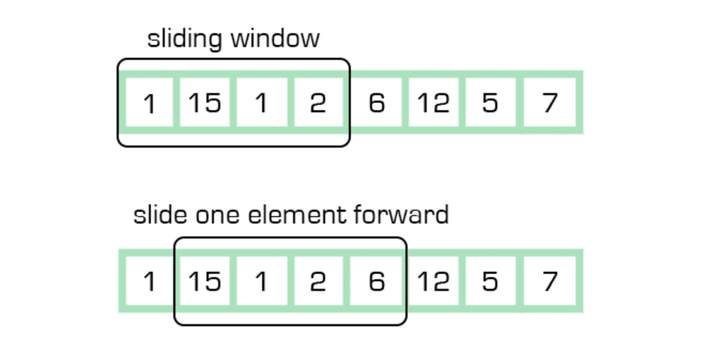

# 1.  Sliding Window Technique in Python

## Introduction
The **Sliding Window** technique is an optimized approach for solving problems related to **subarrays, substrings, or contiguous sequences** in an array or string. Instead of recalculating values for every possible window, we use a **moving window** to process elements efficiently.

### **Why Sliding Window?**
- Reduces **time complexity** from **O(n*k) to O(n)** in many cases.
- Works well with problems that involve **contiguous sequences** (subarrays, substrings).
- Commonly used in **prefix sum**, **two-pointer techniques**, and **dynamic programming** problems.


---

## **Types of Sliding Window**

### 1️⃣ **Fixed-Size Sliding Window**
- The window size (`k`) remains constant.
- Used for problems like "Find the maximum/minimum/average in every subarray of size `k`."

#### **Example: Maximum Average Subarray of Size `k`**
```python
from typing import List

def findMaxAverage(nums: List[int], k: int) -> float:
    windowsum = sum(nums[:k])  # Initial sum of first k elements
    max_sum = windowsum
    
    for i in range(k, len(nums)):
        windowsum += nums[i] - nums[i - k]  # Slide the window
        max_sum = max(max_sum, windowsum)
    
    return max_sum / k  # Return maximum average
```
**Time Complexity:** `O(n)`, **Space Complexity:** `O(1)`

---

### 2️⃣ **Variable-Size Sliding Window**
- The window size **expands and contracts** dynamically based on conditions.
- Useful for problems like "Find the shortest/longest subarray that satisfies a condition."

#### **Example: Smallest Subarray with Sum ≥ `S`**
```python
from typing import List

def minSubArrayLen(target: int, nums: List[int]) -> int:
    left = 0
    window_sum = 0
    min_length = float('inf')
    
    for right in range(len(nums)):
        window_sum += nums[right]
        
        while window_sum >= target:  # Contract the window
            min_length = min(min_length, right - left + 1)
            window_sum -= nums[left]
            left += 1
    
    return min_length if min_length != float('inf') else 0
```
**Time Complexity:** `O(n)`, **Space Complexity:** `O(1)`

---

### 3️⃣ **Sliding Window with Two Pointers**
- Uses two pointers (`left` and `right`) to maintain a **valid window**.
- Used in problems like **longest substring without repeating characters**.

#### **Example: Longest Substring Without Repeating Characters**
```python
from collections import defaultdict

def lengthOfLongestSubstring(s: str) -> int:
    char_map = defaultdict(int)
    left = 0
    max_length = 0
    
    for right in range(len(s)):
        char_map[s[right]] += 1
        
        while char_map[s[right]] > 1:  # If duplicate character found
            char_map[s[left]] -= 1
            left += 1
        
        max_length = max(max_length, right - left + 1)
    
    return max_length
```
**Time Complexity:** `O(n)`, **Space Complexity:** `O(k)`, where `k` is the size of the unique characters in the window.

---

## **Common Variations of Sliding Window in Interviews**

| Problem Type | Example Question |
|-------------|-----------------|
| **Fixed-Size Sliding Window** | Maximum sum of subarray of size `k` |
| **Variable-Size Sliding Window** | Smallest subarray with sum ≥ `S` |
| **Sliding Window with HashMap** | Longest substring without repeating characters |
| **Sliding Window with Deque** | Maximum of all subarrays of size `k` (Monotonic Queue) |

---

## **Advanced Sliding Window: Monotonic Deque**
For problems like "Find the maximum in each sliding window of size `k`" in `O(n)`, we use a **deque** (double-ended queue).

#### **Example: Maximum in Each Sliding Window of Size `k`**
```python
from collections import deque
from typing import List

def maxSlidingWindow(nums: List[int], k: int) -> List[int]:
    dq = deque()
    result = []
    
    for i in range(len(nums)):
        while dq and dq[0] < i - k + 1:
            dq.popleft()  # Remove elements outside the window
        
        while dq and nums[dq[-1]] < nums[i]:
            dq.pop()  # Maintain decreasing order
        
        dq.append(i)
        
        if i >= k - 1:
            result.append(nums[dq[0]])  # Add maximum for this window
    
    return result
```
**Time Complexity:** `O(n)`, **Space Complexity:** `O(k)`

---

## **Key Takeaways**
✅ Use **fixed-size sliding window** for problems with **fixed `k`**.
✅ Use **variable-size sliding window** when expanding/contracting based on conditions.
✅ Use **two-pointer technique** when dealing with **unique elements** in substrings.
✅ Use **monotonic deque** when needing an **optimized `O(n)` solution for max/min in subarrays**.

---

## **Practice Problems**
Try solving these:
1. [Leetcode 209: Minimum Size Subarray Sum](https://leetcode.com/problems/minimum-size-subarray-sum/)
2. [Leetcode 239: Sliding Window Maximum](https://leetcode.com/problems/sliding-window-maximum/)
3. [Leetcode 3: Longest Substring Without Repeating Characters](https://leetcode.com/problems/longest-substring-without-repeating-characters/)
4. [Leetcode 1004: Max Consecutive Ones III](https://leetcode.com/problems/max-consecutive-ones-iii/)

Happy Coding! 🚀

