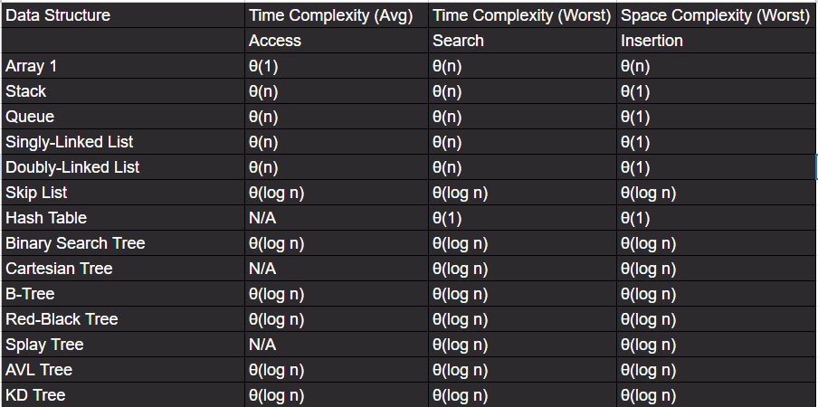
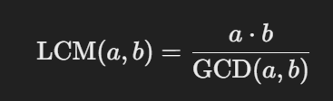

---


---


*1. Striver_a2z_sheet/step1/lec2/pattern11.py*
pattern 
```text
1
0 1
1 0 1
```
**Intuition**: Use two loops—outer for rows and inner for alternating binary values. Determine the starting value for each row (`1` for odd, `0` for even) and toggle using XOR (`start ^= 1`).

```python

    for i in range(1, n+1):
        start: int = i % 2

        for j in range(i):
            print(start, end=' ')
            start ^= 1
        print()
```
===========================

---
*2. Striver_a2z_sheet/step1/lec2/pattern12.py*
```text
1         1
1 2     2 1
1 2 3 3 2 1
```
The pattern can be broken into three parts for each row:
- Left Part: Numbers increment from 1 to the row number (i).
- Spaces: Decreasing spaces between the left and right parts, calculated dynamically based on the row.
- Right Part: Numbers decrement from the row number (i) to 1.
```python
def numberCrown(n: int) -> None:
    for i in range(1,n+1):
        for j in range(1,i+1): # first pattern
            print(j, end=" ")
        # for k in range()
        for k in range(2*(n-i)): # space pattern
            print(' ',end="")
        for l in range(i,0,-1):
            print(l, end=" ")
        print()
```
===========================

---

*3. Striver_a2z_sheet/step1/lec2/pattern14.py*

```text
A
A B
A B C
```

 **Intuition**: In python we cant add ints to str variable. Here we will need tp use in built function `chr` and `ord` to convert ASCII value to str and str to ASCII value respectively.

```python
    for i in range(1, n+1):
        val = 'A'
        for j in range(1,i+1):
            print(val, end =" ")
            val = chr(ord(val) + 1)
        print()
```
===========================

---
*4. Striver_a2z_sheet/step1/lec2/pattern17.py*
```text
    A 
  A B A 
A B C B A
```
```python
    for row in range(n):
        for space in range(n-row-1):
            print(" ", end=" ")
        char= 65
        for patt in range(row+1):
            print(chr(char), end=" ")
            char += 1
        char -= 2
        for patt in range(row):
            print(chr(char), end=" ")
            char -=1
        print()
```
**Intuition**:The pattern consists of centered rows with increasing and then decreasing alphabets. For each row, print spaces first to center-align the characters. Use one loop to handle the increasing sequence of alphabets and another for the decreasing sequence, adjusting the ASCII value (`char`) accordingly. The number of characters increases as `2 * row - 1` for each row.

===========================

---
*5. Striver_a2z_sheet/step1/lec2/pattern19.py*
```text
* * * * * *
* *     * *
*         *
*         *
* *     * *
* * * * * *
```

```python
 for i in range(n):
        # print *
        for y in range(n-i):
            print("*",end=' ')
        # print gap
        for o in range(2*i):
            print(" ",end=' ')
        # reverse *
        for j in range(n-i):
            print("*",end=' ')
        print()

    for s in range(n):
        # print *
        for y in range(s+1):
            print("*",end=' ')
        # print gap
        gap = 2*(n-1)
        for o in range(gap-(2*s)):
            print(" ",end=' ')
        # reverse *
        for j in range(s+1):
            print("*",end=' ')
        print()
```
This code prints a symmetric hourglass star pattern with an upper and lower section. 

1. **Upper Section**:
   - For each row, print decreasing stars (`*`), followed by increasing spaces, and then reverse the stars symmetrically.

2. **Lower Section**:
   - For each row, print increasing stars, followed by decreasing spaces, and then reverse the stars symmetrically.

The pattern transitions smoothly from the upper to the lower section, creating a symmetric hourglass shape.

===========================

---
*5. Striver_a2z_sheet/step1/lec2/pattern22.py*
```text
4444444
4333334
4322234
4321234
4322234
4333334
4444444
```
```python
    for row in range(2 * n - 1):
        for col in range(2 * n - 1):
            left = col
            right = 2 * n - 2 - col
            top = row
            bottom = 2 * n - 2 - top
            val = n - min(min(left, right), min(top, bottom))
            print(val, end="")
        print()
```
This code generates a square number pattern by determining the value at each position based on its **minimum distance from the square's boundaries**.

1. **Pattern Structure**:
   - The square has dimensions `(2n-1) x (2n-1)`, and the values decrease as you move inward from the edges toward the center.

2. **Value Calculation**:
   - For each position `(row, col)`, calculate the minimum distance from all boundaries (left, right, top, bottom) to find the layer it belongs to.
   - Subtract this distance from `n` to determine the value for that position.

---
[Any Pattern problem Solution in python](https://youtu.be/uJA-GVWNjcc?feature=shared&t=1060)

===========================

---
**FInd LCM and GCD**
*Striver_a2z_sheet/step1/lec4/count_digits.py*

```text
# input
a = 12
b = 15
# output
GCD: 3
LCM: 60

```
```python
    def lcmAndGcd(a: int, b: int) -> list[int]:
        # code here
        # gcd
        l = [0, 0]
        gcd = 1
        for x in range(min(a, b)+1, 0, -1):
            if a % x == 0 and b % x == 0:
                gcd = x
                break
        lcm = int((a * b) / gcd)
        l[0], l[1] = lcm, gcd
        return l
#   Using optimal approach

    def gcd(self, a: int, b: int) -> int:
        while a > 0 and b > 0:
            if a > b:
                a = a % b
            else:
                b = b % a
        if a == 0:
            return b
        else:
            return a

    def lcmAndGcd(self, a: int, b: int) -> list[int]:

        ans = [0, 0]
        ans[1] = self.gcd(a, b)
        ans[0] = (a * b) // ans[1]

        return ans
```

#### Intuition for the LCM and GCD Problem

- **GCD Calculation (Euclid’s Algorithm)**:
  The greatest common divisor (GCD) of two integers is the largest integer that divides both without leaving a remainder. Using modulo, repeatedly reduce the larger number until one becomes zero. The remaining non-zero value is the GCD.

- **LCM Calculation**:
  The least common multiple (LCM) is derived from the product of two numbers divided by their GCD:



===========================

---
*Striver_a2z_sheet/step1/lec4/armstrong_number.py*

- A k-digit number ‘NUM’ is an Armstrong number if and only if the k-th power of each digit sums to ‘NUM’.
- Example
153 = 1^3 + 5^3 + 3^3.

===========================

---
*Print All Divisors of a number Striver_a2z_sheet/print_all_divisiors_of_a_number.py*

#### Solution and Intuition
```text
16
[1, 2, 4, 8, 16]
```

```python
def printDivisors(n: int) -> List[int]:
    divisors = []
    for i in range(1, int(n**0.5) + 1):  # Iterate up to the square root of n
        if n % i == 0:  # Check if i is a divisor
            divisors.append(i)  # Add the divisor
            if i != n // i:  # Avoid adding the square root twice
                divisors.append(n // i)
    return sorted(divisors)  # Sort the divisors before returning
```
### Explanation:
1. **Divisors Come in Pairs:**
   - If `i` is a divisor of `n`, then `n // i` is also a divisor. For example:
     - If `n = 28` and `i = 2`, then `n // i = 28 // 2 = 14`. So both 2 and 14 are divisors.

2. **Avoid Adding the Same Divisor Twice:**
   - If `n` is a perfect square, one of the divisors is repeated because `i` equals `n // i` for the square root of `n`. For example:
     - If `n = 36` and `i = 6`, then `n // i = 36 // 6 = 6`. Without the check, 6 would be added twice.

3. **Code Logic:**
   - When a divisor `i` is found:
     - Add `i` to the divisors list.
     - Check if `i` is not equal to `n // i` (to ensure no duplicates).
     - If the check passes, also add `n // i`.

===========================

*Striver_a2z_sheet/step1/lec4/print_sum_of_1_to_n_divisiors.py*
Problem: Sum of Divisors for All Numbers from 1 to n

```text
Input: n = 4
Output: 15
Explanation:
F(1) = 1
F(2) = 1 + 2 = 3
F(3) = 1 + 3 = 4
F(4) = 1 + 2 + 4 = 7
So, F(1) + F(2) + F(3) + F(4)
    = 1 + 3 + 4 + 7 = 15
```
```python
class Solution:
    def sumOfDivisors(self, n):
    	#code here 
        sum=0
        for x in range(1,n+1):
            sum = sum + x*(n//x)
        return sum
```
#### Logic Explanation:
1. **Objective**:
   Find the sum of divisors for all numbers from 1 to n efficiently.

2. **Key Observation**:
   - A number `x` is a divisor for every multiple of `x`.
   - The number of times `x` appears as a divisor is determined by the count of its multiples, which is `n // x`.

3. **Formula**:
   For each number `x` from 1 to n, its total contribution to the sum is:
   
   x * (n // x)
   
   This avoids the need to explicitly find divisors for every number.

4. **Approach**:
   - Loop from 1 to n.
   - Add `x * (n // x)` to the total sum for each value of `x`.

5. **Efficiency**:
   - This approach avoids nested loops for finding divisors, making it efficient.

#### Example for n = 4:
- `x = 1`: Contribution = `1 * (4 // 1) = 4`
- `x = 2`: Contribution = `2 * (4 // 2) = 4`
- `x = 3`: Contribution = `3 * (4 // 3) = 3`
- `x = 4`: Contribution = `4 * (4 // 4) = 4`
- **Total Sum**: `4 + 4 + 3 + 4 = 15`

=========================== Basic Recursion
---
*Striver_a2z_sheet/step1/lec5/sum_of_first_n_terms.py*
for n we need ans such that
```ans = 1**3 +2**3+.....+n**3```
```python
class Solution:
    def sumOfSeries(self,n):
        #code here
        if n==1:
            return 1
        return n**3 + self.sumOfSeries(n-1)
```
- For recursion a base condition is required to that recursion can stop at a levl
- Along with that it requires logic that should run in every recursion

=========================== 

---

*Reverse an Array - Striver_a2z_sheet/step1/lec5/reverse_an_array.py*

```text
Enter array elements: 1 2 3 4 5
[5, 4, 3, 2, 1]
```

### Intuition

The goal of reversing an array is to swap elements from the two ends towards the center. A recursive approach simplifies this process by breaking it down into smaller subproblems.

#### Steps:

1. **Base Case**: 
   - If the left index is greater than or equal to the right index, the array is fully reversed, and we return it.

2. **Swap Elements**:
   - Swap the elements at the `left` and `right` indices.

3. **Recursive Call**:
   - Move towards the center by incrementing `left` and decrementing `right`, then call the function recursively.

### Code Explanation:

```python
def reverseArray(self, arr):
    length = len(arr) - 1
    return self.reverse(arr, 0, length)

def reverse(self, arr, left, right):
    if left >= right:
        return arr

    arr[left], arr[right] = arr[right], arr[left]

    return self.reverse(arr, left + 1, right - 1)
```

### Complexity:
- **Time Complexity**: O(n) - Each element is processed once.
- **Space Complexity**: O(n) - Due to recursive call stack.

===========================

---

*Factorials Less than or Equal to n - Striver_a2z_sheet/step1/lec5/factorials_less_than_or_equal_to_n.py*
```text
Input: n = 6
Output: 1 2 6
Explanation: The first three factorial numbers are less than equal to n but the fourth factorial number 24 is greater than n. So we print only first three factorial numbers.
```
### Intuition

The goal is to find all factorials that are less than or equal to a given integer `n`. Factorials grow rapidly, so the number of factorials below `n` will be limited.

#### Steps:

1. **Factorial Calculation**:
   - Use a recursive function to calculate the factorial of a number `x`. The base case is when `x` is 1, returning 1.

2. **Collect Factorials**:
   - Iterate through numbers from 1 to `n`, calculating the factorial for each.
   - If the factorial is less than or equal to `n`, add it to the results list.

#### Code Explanation:

```python
class Solution:
    def factorialNumbers(self, n) -> List[int]:
    # 	 declaring variables for empty list, a counter and fact value
        result: List[int] =[]
        fact: int = 1
        counter: int = 1
        
        while fact <=n:
            result.append(fact)
            counter +=1
            fact *= counter
            
        return result

```

### Complexity:
- **Time Complexity**: O(n^2) - Each factorial calculation takes O(n) time, and we compute it for `n` numbers.
- **Space Complexity**: O(n) - Due to the recursion stack used in calculating factorials.

---


===========================

---

*Fibonacci Number -Striver_a2z_sheet/step1/lec5/fibonnaci_number.py*

In the plain recursive approach:
```python
def fib(n: int) -> int:
    if n <= 1:
        return n
    return fib(n-1) + fib(n-2)
```

- This calculates `fib(n-1)` and `fib(n-2)` recursively.
- Each recursive call further calculates its two predecessors, resulting in **many redundant calculations**. For example:
  - `fib(5)` calls `fib(4)` and `fib(3)`
  - `fib(4)` calls `fib(3)` and `fib(2)`
  - Notice that `fib(3)` is calculated multiple times unnecessarily.

The **time complexity** of this plain recursive approach is **O(2^n)** because the recursion tree grows exponentially.

---

#### **How Memoization Optimizes the Solution**
```python
from functools import lru_cache
class Solution:
    @lru_cache(maxsize=None)
    def fib(self, n: int) -> int:
        if n < 2: return n
        return self.fib(n-1) + self.fib(n-2)
```

1. **Memoization Explained:**  
   The `@lru_cache` decorator automatically **stores the results of previous calls** to the `fib` function in memory.  
   - If `fib(4)` is computed once, its result is stored.
   - When `fib(4)` is called again (e.g., from `fib(5)`), the stored result is used instead of recalculating it.

2. **Impact on Time Complexity:**  
   With memoization, each Fibonacci number is computed only **once**.  
   - The recursion tree becomes linear instead of exponential.  
   - The time complexity reduces to **O(n)**, with a space complexity of **O(n)** for the cache.

---

#### **Comparison of Run Times**
- **Plain Recursion:** Recomputes Fibonacci numbers multiple times, resulting in an exponential growth of function calls. For larger `n`, this becomes extremely slow.
- **Memoized Recursion:** Avoids redundant calculations by caching results, making it significantly faster, especially for large `n`.

---

#### **When to Use Each**
1. **Plain Recursion:**  
   - Suitable for small input sizes or when learning basic recursion concepts.
   - Useful in scenarios where memory usage is a concern, but only for very small `n`.

2. **Memoized Recursion:**  
   - Always preferred for problems like Fibonacci where there is **overlapping subproblem repetition**.
   - Makes the solution scalable for larger input sizes.

---

#### **Visualization Example**
Let’s calculate `fib(5)` for both approaches:

#### **Plain Recursion:**
```
fib(5)
|- fib(4)
|  |- fib(3)
|  |  |- fib(2)
|  |  |  |- fib(1) -> 1
|  |  |  |- fib(0) -> 0
|  |  |- fib(1) -> 1
|  |- fib(2)
|     |- fib(1) -> 1
|     |- fib(0) -> 0
|- fib(3)
   |- fib(2)
   |  |- fib(1) -> 1
   |  |- fib(0) -> 0
   |- fib(1) -> 1
```
**Many redundant calls** (e.g., `fib(1)` is called 5 times).

#### **Memoized Recursion:**
```
fib(5)
|- fib(4)
|  |- fib(3)
|  |  |- fib(2) -> Cached
|  |  |- fib(1) -> Cached
|  |- fib(2) -> Cached
|- fib(3) -> Cached
```
Each Fibonacci number is computed only once and reused.

===========================
---
*Highest / Lowest Frequency Elements - Striver_a2z_sheet/step1/lec6/highest_and_lowest_frequency_elements.py*

Given an array 'v' of 'n' numbers.
Your task is to find and return the highest and lowest frequency elements.

If there are multiple elements that have the highest frequency or lowest frequency, pick the smallest element.
```text
Example:
Input: ‘n' = 6, 'v' = [1, 2, 3, 1, 1, 4]

Output: 1 2
```
```python
def getFrequencies(v: List[int]) -> List[int]: 
    
    freq = {}
    for val in v:
        if val in freq:
            freq[val] +=1
        else:
            freq[val] = 1
    max_freq = max(freq.values())
    min_freq = min(freq.values())

    max_val = min([key for key, value in freq.items() if value==max_freq])
    min_val = min([key for key, value in freq.items() if value==min_freq])

    return [max_val, min_val]
```